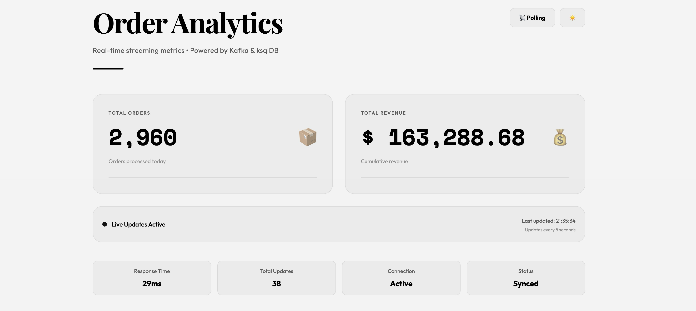

# Real-Time Order Analytics Dashboard

A learning project demonstrating real-time data streaming with Kafka, ksqlDB, and Server-Sent Events (SSE).

## Screenshot

The dashboard displays real-time order metrics with live updates. Toggle between polling and SSE modes to compare update mechanisms.



## Architecture

```
┌─────────────┐         ┌─────────┐         ┌──────────┐         ┌──────────┐
│   Browser   │────────▶│ FastAPI │────────▶│ ksqlDB   │────────▶│  Kafka   │
│  Dashboard  │◀────────│ Backend │◀────────│  Server  │◀────────│  Broker  │
└─────────────┘         └─────────┘         └──────────┘         └──────────┘
                                                                        ▲
                                                                        │
                                                              ┌─────────┘
                                                              │
                                                        ┌──────────┐
                                                        │ Producer │
                                                        │ (Worker) │
                                                        └──────────┘
```

## Features

- **Dual Update Modes**: Toggle between Server-Sent Events (SSE) and HTTP polling via button in dashboard
- **SSE Fallback**: Automatically falls back to polling if SSE connection fails
- **ksqlDB Integration**: Aggregates order data in real-time using SQL streams
- **Docker Compose Setup**: Complete infrastructure in containers (Kafka, Zookeeper, ksqlDB, FastAPI)
- **Live Dashboard**: Beautiful Tailwind CSS UI with dark/light theme toggle

## Tech Stack

- **Backend**: FastAPI, Python 3.12
- **Data Pipeline**: Kafka, ksqlDB
- **Frontend**: HTML5, Tailwind CSS, Vanilla JavaScript
- **Infrastructure**: Docker, Docker Compose
- **Package Management**: uv

## Project Structure

```
.
├── backend/
│   ├── main.py         # FastAPI app with SSE endpoint
│   └── producer.py     # Kafka producer generating sample orders
├── frontend/
│   └── dashboard.html  # Real-time analytics dashboard
├── docker-compose.yaml # Service orchestration
├── Dockerfile          # Container image definition
├── pyproject.toml      # Python dependencies
└── README.md           # This file
```

## Getting Started

### Prerequisites

- Docker & Docker Compose

### Running the Project

1. **Clone and navigate to the project**

2. **Start all services**
   ```bash
   docker-compose up
   ```

   This starts:
   - Zookeeper & Kafka (message broker)
   - ksqlDB (stream processing)
   - FastAPI backend on `http://localhost:8000`
   - Producer (generates sample order data)
   
   **Note**: The server depends on ksqlDB being healthy. First startup may take 1-2 minutes while services initialize.

3. **Open the dashboard**
   ```
   http://localhost:8000
   ```

4. **Optional: View Kafka topics**
   ```
   http://localhost:8080  # Kafka UI
   ```

## How It Works

### Data Flow

1. **Producer** (`backend/producer.py`)
   - Generates random orders every second
   - Publishes to Kafka topic `order_created`

2. **ksqlDB** (initialized in `backend/main.py`)
   - Creates a stream from Kafka topic
   - Aggregates data: `COUNT(*) AS total_orders`, `SUM(amount) AS total_amount`
   - Stores in materialized view `order_stats`

3. **FastAPI Backend** (`backend/main.py`)
   - `/stats` - HTTP endpoint for polling
   - `/stats/stream` - SSE endpoint for real-time streaming (continuous updates every 5s)

4. **Frontend** (`frontend/dashboard.html`)
   - Starts with polling mode by default
   - **Mode Toggle Button** (📡 Polling / 🌊 SSE) lets users switch between modes
   - Displays: total orders, total revenue, response times, update count, connection status

### Server-Sent Events (SSE) vs Polling

SSE is a simpler alternative to WebSockets for one-way server-to-client streaming:

```javascript
const eventSource = new EventSource('/stats/stream');
eventSource.onmessage = (event) => {
  const data = JSON.parse(event.data);
  // Update UI with data
};
```

Backend yields data in SSE format:
```python
yield f"data: {json.dumps(stats)}\n\n"
```

#### Observing the Difference

Open the browser's **Network tab** (DevTools → Network) and toggle between polling and SSE modes:

- **Polling Mode**: See repeated `/stats` requests every 5 seconds. Each request is independent.
- **SSE Mode**: See a single `/stats/stream` request that stays open. New data arrives as a continuous stream without additional requests.

This visually demonstrates why SSE is more efficient for real-time updates.

## Learning Points

- **Real-time Data**: How Kafka topics stream data to multiple consumers
- **Stream Processing**: Using ksqlDB for SQL-based aggregations on streaming data
- **SSE vs Polling**: Practical comparison of two update mechanisms
  - SSE: More efficient, persistent connection, continuous push
  - Polling: Simpler, periodic requests, higher latency
- **Docker Compose**: Orchestrating multi-service applications locally
- **FastAPI**: Building async endpoints with streaming responses

## Stopping Services

```bash
docker-compose down
```

## Notes

- The producer generates dummy orders to simulate real traffic
- ksqlDB queries run continuously emitting changes (EMIT CHANGES)
- Frontend updates UI
